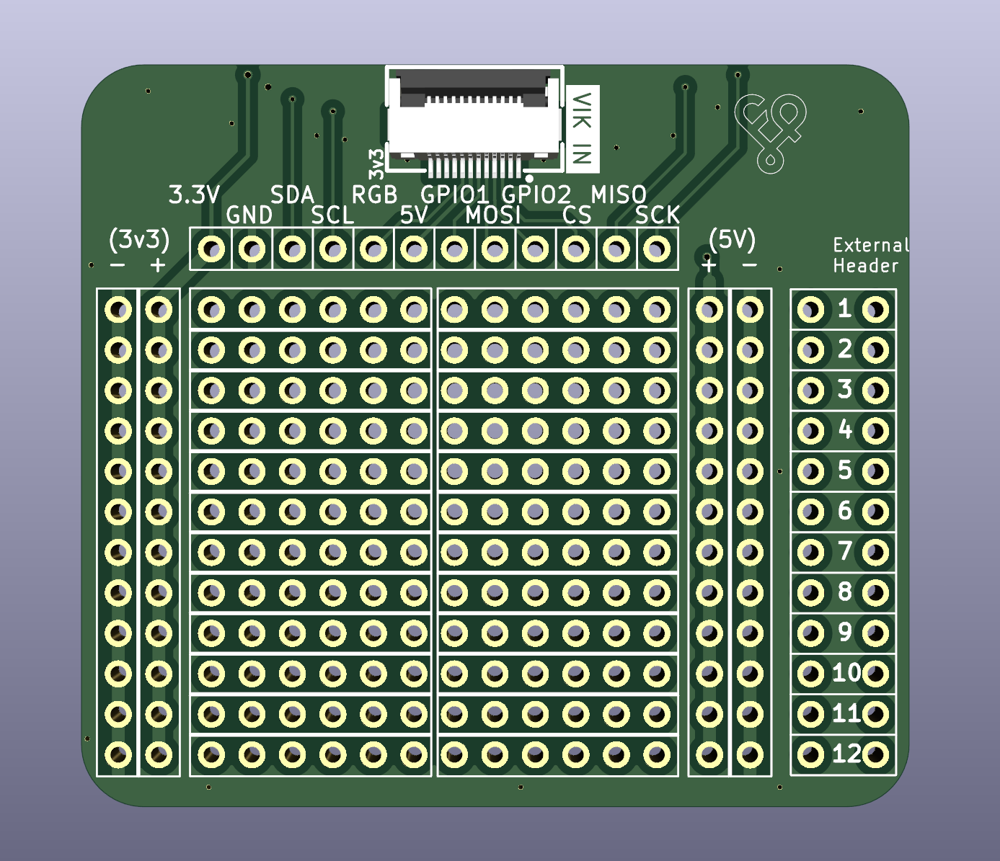
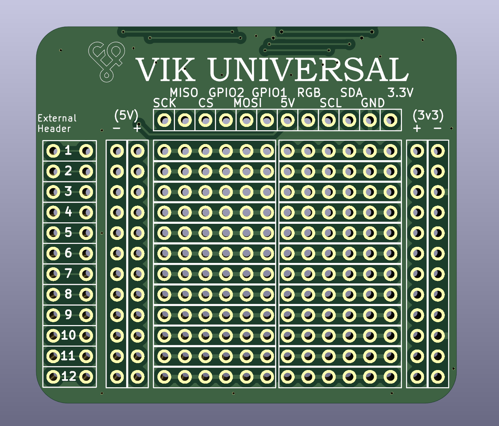

# VIK universal (breadboard)

## Overview

This is a simple pcb that allows you to connect any series of up to 12 pin headers to a VIK connector, in any order.

You solder one of the numbered through holes to a column. Be careful not to solder multiple signals from the 3rd party board to the same VIK signal (each column). Each column of through holes (except the numbered ones on the left or right) are all wired together.

## Fabrication and BOM

For PCB fabrication, you can use the files in the production folder.

* gerbers.zip - the file used to fabricate the pcb
* bom.csv - used for PCBA. You can also use the part numbers in this file to look up the exact parts as [lcsc.com](https://lcsc.com)
* positions.csv - used for PCBA

Using the 3 files above, this has been tested at [jlcpcb.com](https://jlcpcb.com)

## VIK module certification

| Category                | Classification          | Response           |
| ----------------------- | ----------------------- | ------------------ |
| FPC connector           | Required                | :heavy_check_mark: |
| Breakout pins           | Recommended             | :heavy_check_mark: |
| Uses: SPI               | Optional                | N/A                |
| SPI used for SPI only   | Strongly recommended    | N/A                |
| Uses: I2C               | Optional                | N/A                |
| I2C used for I2C only   | Strongly Recommended    | N/A                |
| I2C pull ups            | Required                | N/A                |
| Uses: RGB               | Optional                | N/A                |
| Uses: Extra GPIO 1      | Optional                | N/A                |
| Uses: Extra GPIO 2      | Optional                | N/A                |
| Standard PCB Size/Mount | Strongly recommended    | :x:                |

## PCB images

